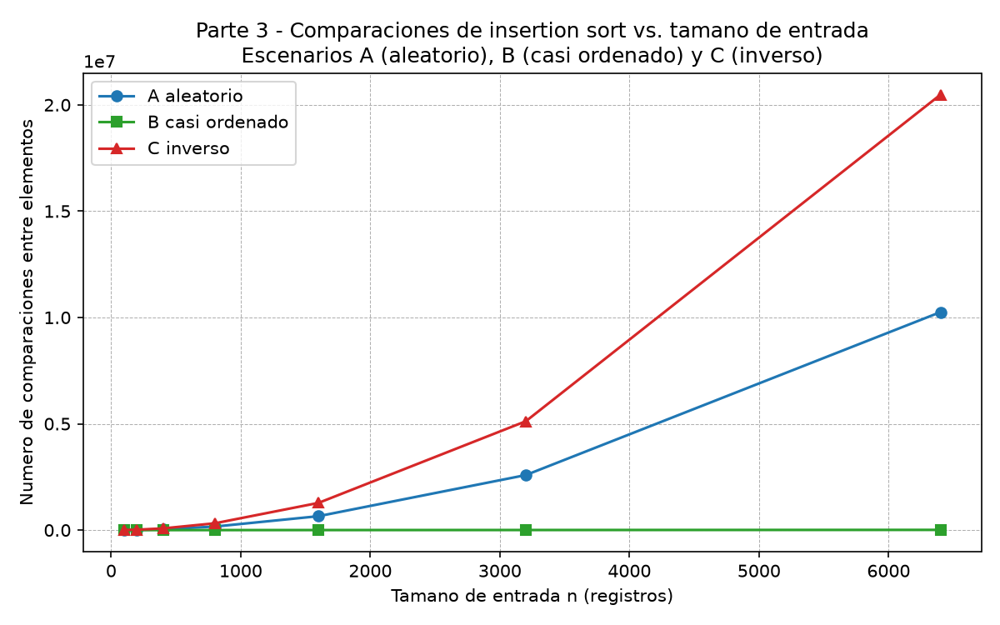
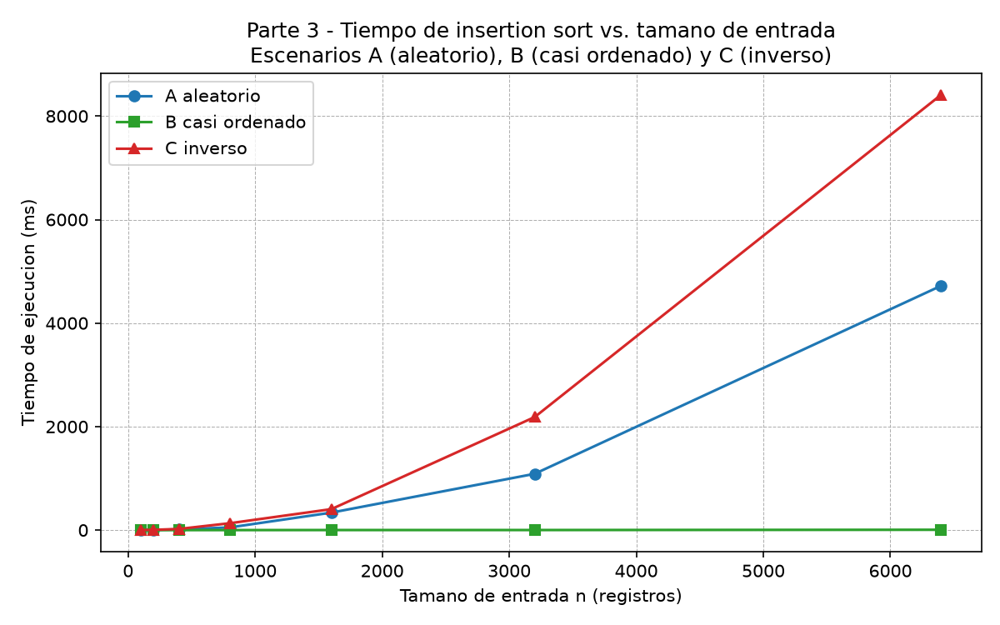
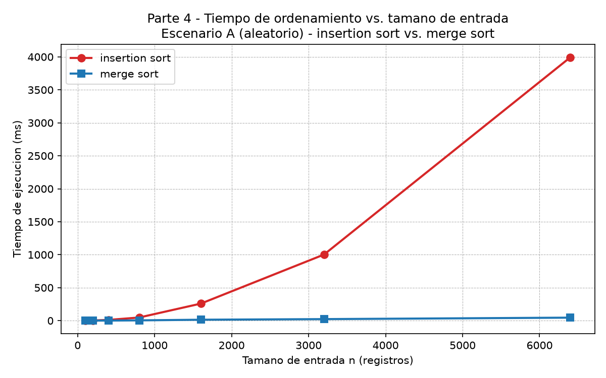

# Laboratorio 1 — Fundamentos, complejidad y recurrencias: Plataforma Tamiza

> **Autor:** Juan David Machado (ITM — Curso de Análisis de Algoritmos)
>
> **Caso:** Secretaría de Salud departamental — proceso nocturno de la plataforma Tamiza que ordena 1.200.000 registros de riesgo cardiovascular entre las 2:00 a. m. y las 6:00 a. m.

Este informe analiza, argumenta y mide qué algoritmo de ordenamiento debe ejecutar Tamiza. Compara `insertion sort` (el algoritmo que hoy corre en producción) con `merge sort` (el candidato divide y vencerás) sobre los tres escenarios de entrada que reporta la plataforma: aleatorio (A), casi ordenado (B) e inverso (C). Las Partes 1 y 2 son argumentativas, las Partes 3 y 4 son teórico-prácticas y se sostienen con código en este mismo repositorio y con las gráficas en [`graficas/`](./graficas/).

---

## Cómo reproducir el experimento

1. Activar el entorno virtual del repositorio:

    ```bash
    # Linux / macOS
    source venv/bin/activate
    # Windows (PowerShell)
    .\venv\Scripts\Activate.ps1
    ```

2. Instalar dependencias (matplotlib ya está registrado en `requirements.txt`):

    ```bash
    pip install -r requirements.txt
    ```

3. Ejecutar las dos partes prácticas desde la raíz del repositorio:

    ```bash
    python laboratorios/lab1-fundamentos-complejidad-recurrencias/parte3_casos.py
    python laboratorios/lab1-fundamentos-complejidad-recurrencias/parte4_complejidad.py
    ```

    Ambos comandos regeneran las tres imágenes PNG dentro de `laboratorios/lab1-fundamentos-complejidad-recurrencias/graficas/`.

---

## Parte 1 — Analizar el algoritmo antes de comprar hardware

**Pregunta:** La Secretaría está por firmar la compra de un servidor del doble de velocidad para que el proceso de Tamiza quepa en la ventana de cuatro horas. ¿Por qué debe analizarse primero el algoritmo, si el que está en producción lleva ocho años entregando el resultado correcto?

Un algoritmo *correcto* es aquel que, para cada entrada posible, devuelve el resultado que la especificación exige. Un algoritmo *viable* es aquel que, además de correcto, devuelve ese resultado dentro de los límites del problema: ventana de tiempo, memoria disponible, latencia tolerable. Las dos propiedades son ortogonales: que un ordenamiento entregue la lista en el orden correcto no dice nada sobre cuánto tarda. Es como una balanza que da el peso exacto pero necesita dos horas por persona: técnicamente correcta, operacionalmente inservible.

Tamiza incurre exactamente en esa separación. Hoy corre `insertion sort`, bien implementado y entrega los 1.200.000 registros ordenados de mayor a menor. La prueba: durante ocho años la Secretaría no reporta resultados errados. La restricción que el sistema *sí* incumple es la **ventana de cuatro horas entre las 2:00 a. m. y las 6:00 a. m.**: en las últimas tres jornadas el proceso no terminó a tiempo y la lista quedó incompleta. El algoritmo sigue siendo correcto; dejó de ser viable.

Duplicar la velocidad del servidor no resuelve el problema porque el cuello de botella no es la velocidad del reloj sino el **orden de crecimiento** del trabajo que el software hace. `insertion sort` crece de forma cuadrática con el tamaño de entrada: al pasar de 1.200.000 a 2.400.000 registros el trabajo se multiplica por cuatro, no por dos. Un procesador dos veces más rápido solo divide por dos el tiempo. Para cuando la Secretaría vuelva a crecer —y el programa de tamizaje cubre nuevos municipios cada año— el mismo problema reaparecerá. Comprar reloj es un parche; no toca el software que sostiene la falla.

Un segundo ejemplo propio, distinto de Tamiza: el sistema de consultas de inventario que programé para una ferretería pequeña como proyecto de clase. El módulo de búsqueda devuelve los productos del catálogo ordenados por precio ascendente cada vez que el cajero presiona "Buscar". Catálogo de cerca de **1.500 productos**; la interfaz exige respuesta en **menos de 200 ms** para que el lector de código de barras no quede bloqueado. La versión inicial usaba `insertion sort` manual: el resultado era correcto, las pruebas unitarias pasaban, pero el cajero esperaba entre **800 ms y 1,2 s** por consulta —cumplía la corrección, violaba la latencia—. Reemplazarlo por `merge sort` redujo el peor caso a menos de 30 ms. La ferretería no necesitaba un disco SSD más rápido: necesitaba un algoritmo cuya curva de crecimiento cupiera en su ventana.

---

## Parte 2 — Responsabilidad ambiental y ética de la implementación

**Pregunta:** Como responsable técnico de Tamiza, ¿qué responsabilidad ambiental y ética asume al decidir qué algoritmo de ordenamiento se ejecuta cada madrugada sobre los datos de 1.200.000 pacientes?

Todo algoritmo que se ejecuta deja una huella: los ciclos de CPU que consume se traducen en energía eléctrica, y esa energía se traduce en calor, en uso del aire acondicionado del centro de datos y, según la matriz energética de la región, en emisiones de carbono. En Tamiza esa huella es **recurrente**: el proceso corre todas las noches durante años, no una sola vez. Si un algoritmo mal elegido tarda una hora más de lo necesario cada madrugada, al cabo de un año suma **365 horas extra de CPU** —y de energía— por la misma tarea que un algoritmo adecuado hacía en minutos. La diferencia entre `insertion sort` y `merge sort` no es abstracta; es kilovatios-hora que se ahorrarían o se desperdiciarían mientras la ciudad duerme.

Sobre los datos corre una carga ética todavía mayor, porque el algoritmo decide en qué orden el centro de contacto llama a 1.200.000 personas. La corrección debe ser la primera condición: una lista incompleta o desorganizada cambia quién recibe la llamada y quién no. Dos perjuicios concretos, con el costo asignado:

- **Pacientes de mayor riesgo que no son contactados a tiempo.** En el escenario C (orden inverso del sistema legado) la lista puede quedar incompleta antes del cierre. Estos pacientes —los de la cola, justo los de menor riesgo según la lista pero potencialmente críticos en la realidad clínica— pueden pasar inadvertidos. El costo de ese error lo asume el **paciente**, en forma de una complicación cardiovascular que una llamada a tiempo habría prevenido; lo asume también la **Secretaría**, en forma de demanda y de daño reputacional. El equipo de desarrollo no lo asume en la historia clínica.

- **Operadores del centro de contacto trabajando con una lista parcial.** Cuando el proceso no termina, el equipo a las 6:00 a. m. recibe una lista incompleta y debe improvisar prioridades. El costo lo asume el **operador** —estrés, decisiones sin respaldo clínico— y, otra vez, el **paciente**, que percibe un servicio improvisado. La Secretaría descarga sobre el operador un riesgo que técnicamente fue una decisión de software.

Esto lleva a la tensión del caso. El orden de la lista no solo organiza la operación: **define a quién se contacta primero**. Esa es una obligación adicional que va más allá del tiempo: el algoritmo debe estar *probado* contra cada escenario de entrada y responder igual ante los tres, porque si no, los pacientes del escenario equivocado quedan sistemáticamente relegados. La eficiencia no es un lujo ambiental: es la condición para que la corrección llegue a todas las personas antes de que se cierre la ventana.

---

## Parte 3 — Peor caso, mejor caso y caso promedio, demostrados en Python

> Código de la Parte 3: [`parte3_casos.py`](./parte3_casos.py). Las funciones comparadas viven en [`algoritmos.py`](./algoritmos.py) y los lotes en [`datos.py`](./datos.py).

### 3.1 — Explicación

Los tres "casos" de un algoritmo son tres maneras de mirar el comportamiento de su costo sobre el **conjunto de todas las entradas de un tamaño fijo** `n`:

- **Peor caso:** el **máximo** del número de comparaciones (o del tiempo) sobre **todas** las entradas posibles de tamaño `n`. Es la cota superior práctica: garantiza que ninguna entrada realista gastará más.
- **Mejor caso:** el **mínimo** sobre el mismo conjunto de entradas de tamaño `n`. Es útil para entender cuándo el algoritmo "se luce", pero no es lo que se usa para decidir si entra a producción.
- **Caso promedio:** el **promedio** (esperanza) sobre una distribución razonable de entradas de tamaño `n`. Suele estar entre los dos anteriores y refleja lo que el sistema sufrirá "en un día típico".

Para decidir si un algoritmo entra a producción con una **ventana estricta** como la de Tamiza, el caso relevante es el **peor caso**: si cumple el peor caso dentro de la ventana, cumple cualquier caso. El caso promedio puede ser optimista; el mejor caso, engañoso.

**Predicción antes de medir** (insertion sort, salida de mayor a menor):

- Escenario **C — inverso** (entrada ascendente cuando se quiere descendente): cada nuevo elemento debe recorrer toda la parte ya ordenada. **Peor caso.**
- Escenario **B — casi ordenado** (98 % ya en el orden que se quiere): cada elemento entra y termina casi en su lugar. **Mejor caso.**
- Escenario **A — aleatorio** (sin relación con el orden que se quiere): comportamiento intermedio. **Caso promedio.**

### 3.2 — Demostración experimental

`insertion_sort` y los tres generadores se implementan sin `sorted()` ni `list.sort()`. Cada corrida mide el algoritmo con `time.perf_counter()` sobre tres repeticiones y promedia. Los tamaños usados son 100, 200, 400, 800, 1600, 3200 y 6400.





Lectura de las gráficas:

- **Peor caso → escenario C (inverso).** La curva roja alcanza `n(n−1)/2` exactamente: 20.476.800 comparaciones para `n = 6400`, que es el valor teórico del peor caso. En tiempo coincide: 8,4 s en `n = 6400`.
- **Mejor caso → escenario B (casi ordenado).** La curva verde se mantiene casi plana: 10.469 comparaciones para `n = 6400`, apenas por encima de `n − 1` (lo que haría una lista ya en orden). En tiempo: 6,5 ms en `n = 6400`.
- **Caso promedio → escenario A (aleatorio).** La curva azul crece de forma aproximadamente cuadrática, pero con un coeficiente ~4× menor que el peor caso: 10.250.847 comparaciones para `n = 6400`, coherente con `~n²/4` esperado para inserción sobre entrada aleatoria. En tiempo: 4,7 s en `n = 6400`.

**Contraste con la predicción:** las tres curvas confirman exactamente lo predicho en 3.1. La teoría del peor caso de `insertion sort` (cuadrático, sobre entrada inversa) es lo que se observa empíricamente; el mejor caso (lineal, sobre entrada ya ordenada o casi) también; y el caso promedio cae entre los dos. No hubo contradicción: la medición validó la predicción.

---

## Parte 4 — Complejidad de merge sort e insertion sort: cálculo y validación

> Código de la Parte 4: [`parte4_complejidad.py`](./parte4_complejidad.py). Las funciones comparadas viven en [`algoritmos.py`](./algoritmos.py) y el lote A en [`datos.py`](./datos.py).

### 4.1 — Cálculo teórico

**Recurrencia de merge sort.** En cada llamada, `merge_sort` divide la lista en dos mitades iguales (`n/2`), resuelve cada mitad recursivamente y combina las dos mitades con la mezcla, que cuesta Θ(`n`). Por lo tanto:

`T(n) = 2 T(n/2) + Θ(n)`

Los tres términos se justifican así:

- `2 T(n/2)`: dos subproblemas recursivos sobre cada mitad del arreglo.
- `Θ(n)`: el costo de combinar las dos mitades en la mezcla, porque cada elemento se copia y compara un número constante de veces.

**Resolución por método maestro.** Identifico:

- `a = 2` (subproblemas por nivel)
- `b = 2` (factor de división del tamaño)
- `f(n) = n` (costo de combinar)

Calculo `log_b(a) = log_2(2) = 1`. Comparo `f(n)` con `n^(log_b a) = n^1 = n`: `f(n) = Θ(n^1)`. Esto satisface el **caso 2** del método maestro (`f(n) = Θ(n^(log_b a)` con `k = 1`). Por lo tanto:

`T(n) = Θ(n^(log_b a) · log n) = Θ(n log n)`

**Cota de insertion sort, línea a línea.** Implementación de referencia (simplificada del archivo):

```text
1  for i in range(1, n):
2      clave = datos[i]
3      j = i - 1
4      while j > -1 and datos[j] < clave:
5          datos[j+1] = datos[j]
6          j -= 1
7      datos[j+1] = clave
```

Conteo por línea:

| Línea | Ejecuciones (mejor caso, lista ya en orden) | Ejecuciones (peor caso, lista inversa) |
| --- | --- | --- |
| 1 (ciclo externo) | `n − 1` | `n − 1` |
| 4 (comparación) | 1 por iteración externa → **`n − 1`** | `i` por iteración externa → **`n(n−1)/2`** |
| 5–6 (desplazamiento) | 0 | `i − 1` por iteración externa → **`n(n−1)/2`** |
| 7 (escritura) | 1 por iteración externa → **`n − 1`** | 1 por iteración externa → **`n − 1`** |

Sumando los términos dominantes:

- **Mejor caso:** `Θ(n)` (la condición del `while` falla en la primera comparación y nunca se entra al cuerpo del desplazamiento).
- **Peor caso:** `Θ(n²)` (el `while` recorre toda la sublista ordenada en cada iteración externa).
- **Caso promedio:** `Θ(n²)` (a cada iteración externa le corresponde en promedio la mitad de la sublista, dando `~n²/4` comparaciones, que pertenece a la misma clase de crecimiento).

**Tabla de complejidades:**

| Algoritmo | Mejor caso | Caso promedio | Peor caso |
| --- | --- | --- | --- |
| `insertion sort` | Θ(`n`) | Θ(`n²`) | Θ(`n²`) |
| `merge sort` | Θ(`n log n`) | Θ(`n log n`) | Θ(`n log n`) |

### 4.2 — Validación experimental

Se mide el tiempo de ambos algoritmos sobre el escenario A (aleatorio) con los mismos tamaños de la Parte 3. Cada medición es la mediana de tres corridas (atenuando el ruido del sistema operativo).



**Lectura de la gráfica.** La curva roja de `insertion sort` crece de forma **cuadrática** —al pasar de `n = 1600` a `n = 6400` (factor 4×), el tiempo pasa de 258 ms a 3.994 ms (factor 15×, consistente con el orden cuadrático). La curva azul de `merge sort` crece de forma **n·log n** — entre los mismos puntos, el tiempo pasa de 13,8 ms a 45,3 ms (factor ~3,3×, el factor `n·log n` predice ~4,8×). A partir de `n = 200`, `merge sort` ya es más rápido; en `n = 6400` es **88× más rápido**.

**Conclusión para Tamiza:** `merge sort`. La curva de `merge sort` se mantiene prácticamente plana en la ventana visible mientras la de `insertion sort` se dispara, y la separación aumenta con `n`. Esto coincide con las complejidades Θ(`n log n`) y Θ(`n²`) calculadas en 4.1. En los tamaños pequeños (`n = 100`) las dos curvas están casi encima porque las constantes de `merge sort` (crear sublistas, llamadas recursivas, comparaciones por referencia en Python) pesan más que la ventaja asintótica —es lo esperado y no contradice la teoría—; la tendencia se invierte ya en `n = 200`.

### 4.3 — Concepto técnico a la Secretaría de Salud

**Para:** Equipo de ingeniería de la Secretaría de Salud departamental.
**Asunto:** Concepto técnico sobre el algoritmo de ordenamiento de la plataforma Tamiza.

**Recomendación.** Reemplazar `insertion sort` por **`merge sort`** en el proceso nocturno que arma la lista de llamadas. El canal de entrada puede cambiar sin aviso (escenarios A, B o C del problema) y el equipo no quiere mantener tres implementaciones: el criterio para resolver ese compromiso es **complejidad en el peor caso independiente del orden de llegada**, y `merge sort` cumple Θ(`n log n`) en cualquier escenario —aleatorio, casi ordenado u orden inverso— mientras que `insertion sort` solo cumple Θ(`n`) cuando la entrada llega casi ordenada (escenario B) y se degrada a Θ(`n²`) en el peor (escenario C). La respuesta que da `merge sort` no depende de cómo lleguen los datos.

**¿Cabe en la ventana de cuatro horas con 1.200.000 registros?** Esta es una estimación, no una medición a esa escala —no es viable correr `insertion sort` hasta `n = 1.200.000` en este equipo—. La extrapolación parte de los puntos medidos (Parte 4, escenario A):

- `insertion sort` en `n = 1.600` tarda 258 ms. La curva empírica tiene forma cuadrática (`t ≈ c · n²`): entre `n = 1.600` y `n = 3.200` el factor real es ~3,9 (cercano al `4` del cuadrado) y entre `n = 3.200` y `n = 6.400` también. Al pasar a `n = 1.200.000`, el factor es 750× → `t ≈ 258 ms · 750² ≈ 1,45 · 10⁸ ms ≈ 40 horas`. **No entra en la ventana ni con el doble de velocidad.**
- `merge sort` en `n = 1.600` tarda 13,8 ms. La curva empírica tiene forma `n log n` (factor de crecimiento ≈ 3,3× entre `n = 1.600` y `n = 6.400`, consistente con `n · log n`). Al pasar a `n = 1.200.000`: `t ≈ 13,8 ms · 750 · log(1.200.000)/log(1.600) ≈ 13,8 ms · 1.500 ≈ 21 s`. Entra en la ventana con margen de tres órdenes de magnitud.

**Sobre la propuesta del servidor del doble de velocidad.** El dato medido que la desmiente es directo, tomado de `graficas/parte4_tiempo.png` (Parte 4, escenario A): al pasar de `n = 800` a `n = 1.600` (factor 2× en registros), el tiempo de `insertion sort` pasó de 51,9 ms a 258 ms —un factor 5×, no 2×—. Duplicar la velocidad del reloj divide el tiempo por 2, pero el problema es que el software hace **cuatro veces más trabajo** cada vez que los registros se duplican. La Secretaría volvería a quedarse corta en cuanto el programa crezca otra vez. La inversión se pierde.

**Una consideración más allá del tiempo.** `merge sort` requiere memoria adicional Θ(`n`): para 1.200.000 enteros son del orden de 10 MB extra —despreciable frente al costo del proceso—. Más relevante: `merge sort` elimina la **dependencia del escenario de entrada**. Hoy, si el flujo de reproceso deja de entregar el 98 % ordenado (escenario B) y comienza a entregar datos desordenados o invertidos, `insertion sort` colapsa sin avisar; los registros quedan mal priorizados y los pacientes de mayor riesgo se atrasan sin que ningún operador lo note a las 6:00 a. m. Con `merge sort` esa fragilidad desaparece.

**Conclusión.** Mantener el software como está y firmar la compra del nuevo servidor no resuelve el problema; lo aplaza. Recomiendo migrar el ordenamiento a `merge sort`, mantener la infraestructura actual y dejar la compra en pausa hasta haber mesureado el proceso en producción con el nuevo algoritmo.

---

## Estructura del repositorio

```
laboratorios/lab1-fundamentos-complejidad-recurrencias/
├── README.md
├── algoritmos.py
├── datos.py
├── parte3_casos.py
├── parte4_complejidad.py
└── graficas/
    ├── parte3_comparaciones.png
    ├── parte3_tiempo.png
    └── parte4_tiempo.png
```
