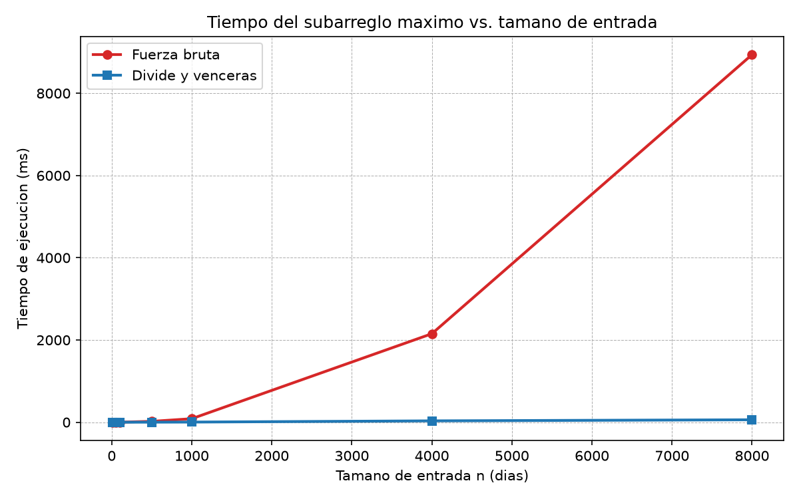
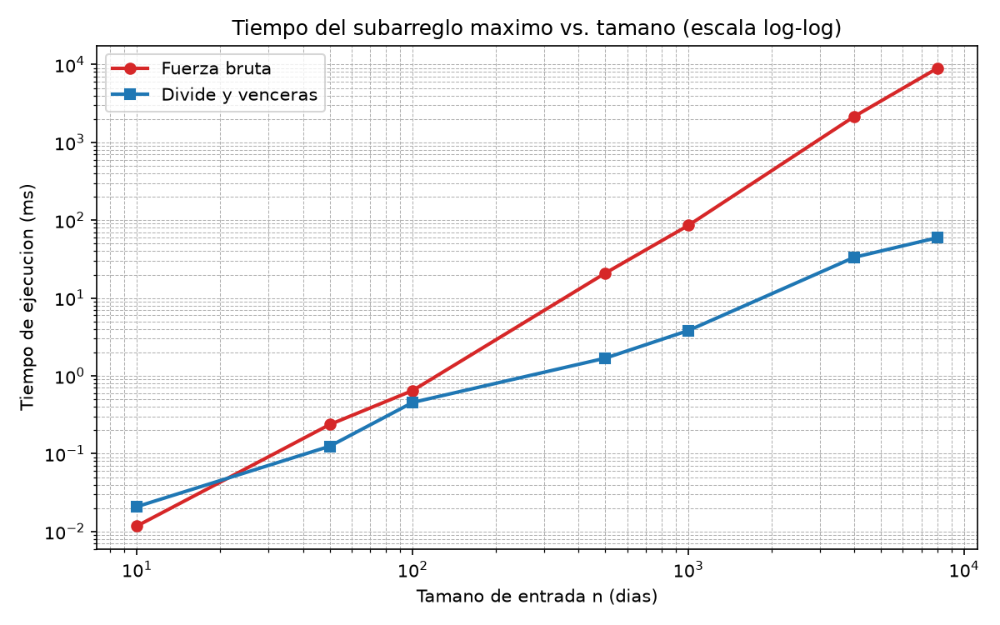

# Laboratorio 2 — Dividir y vencer: el subarreglo máximo

> **Autor:** Juan David Machado Mosquera
>
> **Problema:** la cooperativa de 1.500 tiendas de barrio necesita, para cada tienda, el tramo de días consecutivos de mayor variación acumulada de caja (mejor racha). Se comparan dos soluciones: fuerza bruta y divide y vencerás.

---

## Cómo reproducir el experimento

1. Activar el entorno virtual de la raíz del repositorio:

    ```bash
    # Linux / macOS
    source venv/bin/activate
    # Windows (PowerShell)
    .\venv\Scripts\Activate.ps1
    ```

2. Instalar dependencias (matplotlib ya está en `requirements.txt`):

    ```bash
    pip install -r requirements.txt
    ```

3. Ejecutar las pruebas y la medición desde la raíz del repositorio:

    ```bash
    python laboratorios/lab2-divide-y-vencer/pruebas.py
    python laboratorios/lab2-divide-y-vencer/medicion.py
    ```

    El primer comando verifica las soluciones; el segundo regenera las dos imágenes dentro de `laboratorios/lab2-divide-y-vencer/graficas/`.

---

## Parte 1 — Implementar y verificar las dos soluciones

Código: [`subarreglo.py`](./subarreglo.py) y [`pruebas.py`](./pruebas.py).

Implementé tres funciones en `subarreglo.py`:

- `subarreglo_fuerza_bruta`: recorre todos los pares `(inicio, fin)` y **acumula la suma dentro del ciclo interior**, de modo que cada subarreglo se evalúa en Θ(1) adicional y el total es Θ(n²).
- `suma_cruzada`: barrido lineal desde el punto medio hacia la izquierda y desde `medio + 1` hacia la derecha; produce el mejor tramo que incluye al menos un elemento de cada mitad.
- `subarreglo_maximo`: divide en dos mitades, resuelve recursivamente la izquierda y la derecha, calcula el caso cruzado y devuelve el mejor de los tres (sin llamar a la fuerza bruta).

Ninguna función modifica la lista que recibe. Verifiqué que ambas soluciones coinciden en la **suma** (no en los índices, que pueden diferir entre tramos empatados) para: la serie de ocho días (suma 17), un elemento único, todos los valores negativos, todos positivos, un caso cuyo mejor tramo cruza el punto medio (`[1, -2, 3, -1, 4, -3]`, suma 6) y **30 listas aleatorias** generadas con semilla fija.

---

## Parte 2 — Medir y graficar

Código: [`medicion.py`](./medicion.py).

Medí los tiempos sobre los tamaños `10, 50, 100, 500, 1000, 4000, 8000`, con datos generados con semilla fija 42 (enteros entre −100 y 100) y **la misma lista para ambos algoritmos** en cada tamaño. Cronometré únicamente la llamada al algoritmo con `time.perf_counter()`; repetí cada medición **tres veces y grafiqué la mediana** (como sugiere la guía para atenuar el ruido del sistema operativo). Dentro del experimento verifico con un `assert` que ambas funciones devuelven la misma suma.



Valores medidos (mediana de 3 corridas):

| n | Fuerza bruta (ms) | Divide y vencerás (ms) |
|---:|---:|---:|
| 10 | 0.012 | 0.021 |
| 50 | 0.237 | 0.125 |
| 100 | 0.648 | 0.456 |
| 500 | 20.907 | 1.688 |
| 1000 | 85.680 | 3.823 |
| 4000 | 2152.198 | 33.369 |
| 8000 | 8938.686 | 59.559 |

En escala lineal la curva del divide y vencerás queda pegada al eje; por eso agrego una gráfica en escala log-log donde sí se distingue su forma:



---

## Parte 3 — Análisis

**1. Recurrencia.** `subarreglo_maximo` reparte el arreglo en dos mitades y hace **dos** llamadas recursivas de tamaño `n/2` (izquierda y derecha). Luego el caso cruzado hace **dos barridos lineales** (hacia la izquierda desde el medio y hacia la derecha desde `medio + 1`), que juntos recorren a lo sumo `n` elementos; ese es el costo de combinar. La recurrencia es `T(n) = 2T(n/2) + Θ(n)`. Por el método maestro, `a = 2`, `b = 2`, `log_b a = 1`, y `f(n) = Θ(n^1 log^0 n)`: es el **caso 2** con `k = 0`, de modo que `T(n) = Θ(n log n)`. La fuerza bruta es Θ(n²) porque cuenta todos los pares: el ciclo exterior se ejecuta `n` veces y el interior `n − inicio` veces, lo que suma `n + (n−1) + ⋯ + 1 = n(n+1)/2` iteraciones, cada una con una suma de costo constante.

**2. Lo medido contra lo esperado.** Al crecer `n`, la curva roja (fuerza bruta) se dispara mientras la azul (divide y vencerás) sube muy despacio. Duplicando `n` de 4000 a 8000, la fuerza bruta pasó de 2152 a 8939 ms, un factor **4.15× ≈ 4×**, que es justo lo que predice Θ(n²). El divide y vencerás pasó de 33.4 a 59.6 ms, un factor **1.78×** frente al 2.17× que predice `n log n`; la diferencia se debe a que sus tiempos son tan pequeños (decenas de ms) que el ruido del sistema operativo pesa más que el costo real, un efecto que la guía reconoce como normal. Pese a ello, su curva queda claramente muy por debajo del crecimiento cuadrático.

**3. Tamaños pequeños.** En mis mediciones el cruce ocurre ya en `n = 50`: con `n = 10` la fuerza bruta gana apenas (0.012 vs. 0.021 ms), pero desde `n = 50` el divide y vencerás es más rápido y la diferencia crece. Aparece temprano porque la fuerza bruta tiene una constante muy baja (solo un ciclo anidado), mientras que el divide y vencerás paga recursión y el barrido cruzado; esa ventaja constante se agota muy pronto frente al orden cuadrático.

**4. ¿Cuándo conviene dividir?** El máximo de un arreglo se halla en una sola pasada, Θ(n). Dividirlo a la mitad cuesta `T(n) = 2T(n/2) + Θ(1)`, que por el método maestro (caso 1) da Θ(n): el costo de **combinar** es trivial (tomar el mayor de dos mitades), así que dividir no cambia el orden y solo añade recursión y llamadas. En el subarreglo máximo, en cambio, combinar cuesta Θ(n) (el barrido cruzado); por eso ahí dividir sí aporta, porque ese costo de combinación está compensado por no volver a recorrer todos los pares. La conclusión es que conviene dividir cuando reducir el número de subproblemas ahorra más de lo que cuesta combinarlos.

**5. Concepto para la gerente.** Recomiendo **divide y vencerás**. Es una estimación (no corrí el experimento en n = 1.000.000): escalando la medición de `n = 8000` según `n log n`, el divide y vencerás tardaría del orden de **11 segundos** (`59.6 ms · (1.000.000/8000) · (log₂ 1.000.000 / log₂ 8000)`), mientras que la fuerza bruta, escalando por `n²`, tardaría del orden de **39 horas** (`8.94 s · (1.000.000/8000)²`). No es una regla de tres: cada uno se multiplica por su orden de crecimiento propio. Para millones de registros la fuerza bruta es inviable y el divide y vencerás responde en segundos.

---

## Estructura del entregable

```
laboratorios/lab2-divide-y-vencer/
├── README.md
├── subarreglo.py
├── pruebas.py
├── medicion.py
└── graficas/
    ├── tiempo_vs_n.png
    └── tiempo_vs_n_loglog.png
```